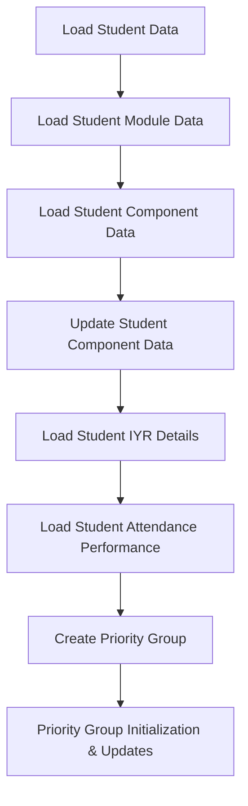

# Data Pipeline Setup for Student Support

## Objectives

1. **Load student data**
2. **Load student module data**
3. **Load student component data**
4. **Update student component data**
5. **Load student IYR details**
6. **Load student attendance performance**  
    *Note: Only supports last term at the moment*
7. **Create priority group**

---

## Priority Group Criteria

**Start of the Year Priority Group:**

- Level 3 & 4 students to receive 2x meetings per trimester *(QlikView, student level)*
     - *Note: Unable to get Level 3 data, need to verify data sources in further research*
- Students trailing a module *(QlikView, checking if students are taking additional retake modules from Student by Module data)*
- Students repeating the year with attendance  
  *(Those repeating without attendance should still receive email support if needed; QlikView, students who didn’t progress, Reg Status = RP)*
- Students who engaged in IYR last year  
  *(Checking submission date between DDL and resit & passed)*
- Students who progressed through the resit period  
  *(Submission date after IYR & passed)*
- Students with less than 70% engagement last year/trimester  
  *(Jisc, all modules)*
- Students engaging in IYR in the current year  
  *(Drawn down during the year, not at the start; only after DDL & L4 only)*
- Students in T2 carrying a fail from T1 *(T2 priority only; for start of T2 only, not start of AY; students who fail but still wait to see resit result)*

> **Note:** Priority Group is initialized every academic year, updated each trimester, and triggered based on criteria.

---

## Footnotes

### QlikView Data

- QlikView (student level, submission date, last year progression/resit)
- Student by Programme with Registration Status
- Programme Year – Student Level *(filtered: Level = UG, Campus = Main, Reg Status Code != Withdrawn)*
     - Reg Status = RP: Retake the year
     - Reg Status = RE: Student progressed
- Component Due Dates By Block
- Component Due Date & Part of Term - Submission Date
- Student on Module by Registration Status
     - Use this to check how many modules each student is taking
     - *Note: If student Programme Reg Status is RE, but module Enrollment is not RE, student is trailing*

### EBR (Module Report and Programme Report) Data

- Component raw record contains:
     - `"NS"` - Non submission
     - `"R"` - RAP
     - `"P"` - PMC
     - `"L"` - Late submission
     - `""` - Running module component
     - `"*"` - First trial
     - `"**"` - Second trial

---

## Data Pipeline Structure

### QlikView Data  
**Key:** BannerID, Module CRN
- Current Year Student List
- Each Student Module List

### EBR Data  
**Key:** Programme Code, Module CRN, BannerID
- Programme info
- Student Component Title
- Student Component Submission Status
- Student Score  
  *Note: Module report structure varies; component repeating condition may exist in raw data*

### Source Document  
**Key:** Module CRN, Component Title, Component DDL
- Student module component DDL, Module Leader, Admin Team, etc.
- Component Amount for clean EBR data

### IYR Document  
**Key:** Banner ID
- Priority list update
- IYR submission date

### StEP Document  
**Key:** Banner ID, Attendance Status
- Priority list update
- *Note: Last term data available at the moment; to update in trimester 2*
- *Note: If last year data becomes available in the future, use to initialize priority list*

---

## Data Pipeline Folder Structure

```plaintext
data-pipeline/
├── qlikview/
│   ├── student_list.csv
│   └── student_module_list.csv
├── ebr/
│   ├── programme_report.csv
│   ├── module_report.csv
├── source_documents/ 
│   └── all_campus_main_assessments.csv
├── iyr/
│   └── iyr_list.csv 
└── step/
     └── step.csv 
```

---

## Data Pipeline Flowchart


